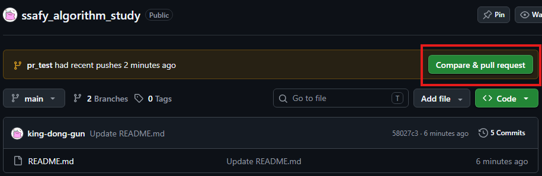
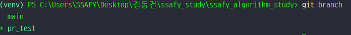
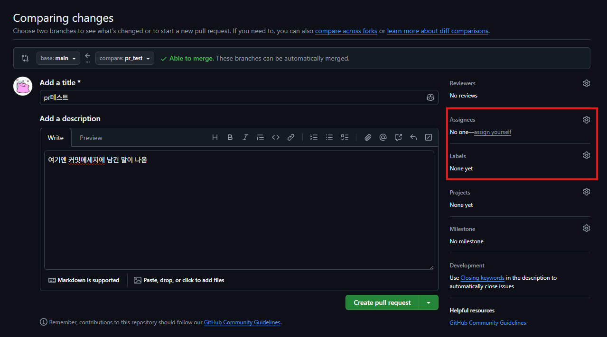
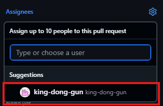
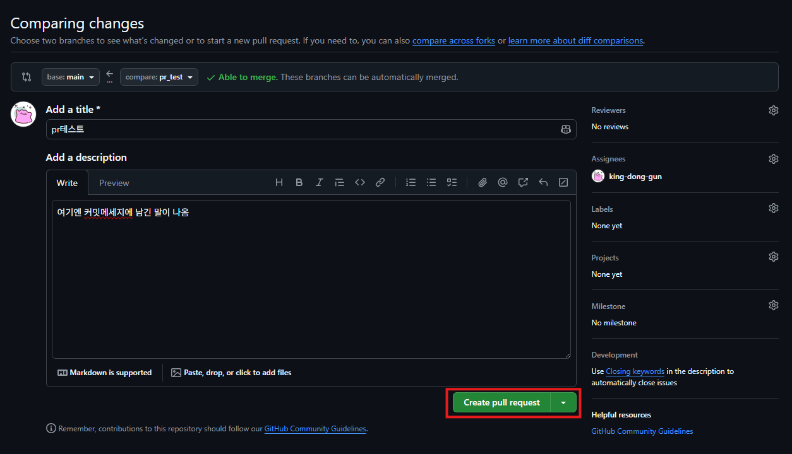
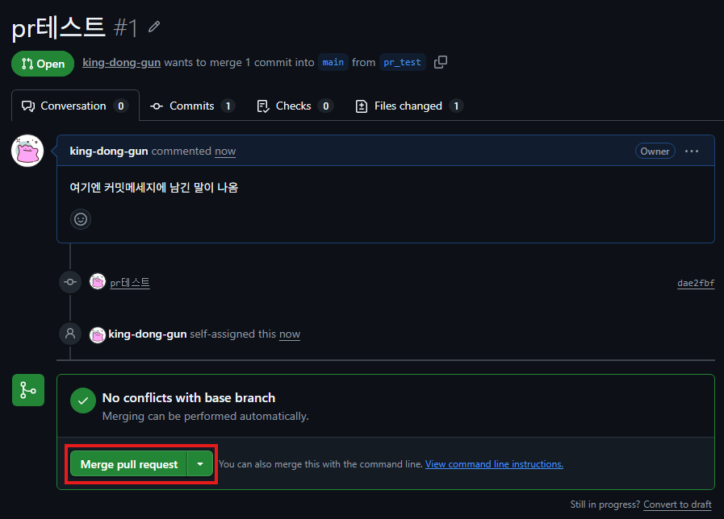
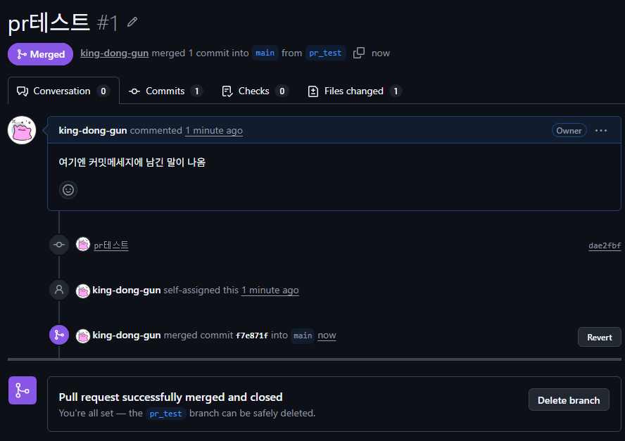

# SSAFY 16기 코테/알고리즘 스터디

2026.08 ~ ing.

스터디원: `김동건`, `김동준`, `정승원`, `최윤석`

## 최초 환경 설정

VS Code 또는 IntelliJ의 터미널에서 아래 명령어를 실행합니다.

```bash
# 1. 저장소 복제
git clone https://github.com/king-dong-gun/ssafy_algorithm_study.git

# 2. 저장소로 이동
cd ssafy_algorithm_study

# 3. 본인 폴더만 보이도록 설정
git sparse-checkout init --cone
git sparse-checkout set <본인이름>

# 4. 본인 브랜치로 이동
git switch <본인이름>

# 5. 본인 폴더로 이동
cd <본인이름>

# 주차별 폴더 생성: 스터디 진행 후 week01, week02, week03......과 같이 생성
# 예: 1주차
mkdir week01
cd week01

# 문제 풀이 후 Commit / Push
# 변경된 파일 추가
git add .
# 변경분이 많은데 한 문제만 올릴 경우
git add 파일명

# 한 문제를 풀었을 경우
git commit -m "날짜_문제제목"

# 여러 문제를 풀었을 경우
git commit -m "날짜_문제제목 외 n문제"

# 최초 1회 Push
git push --set-upstream origin <본인이름>
# 최초 Push 이후부터는 아래 명령어만 사용
git push
```
```text
※ master 브랜치에는 직접 Push하지 않습니다.
주차별 문제 풀이가 끝나면 본인 브랜치에서 master 브랜치로 PR을 생성합니다.
```

<details>
<summary>📌 PR 생성 방법 보기</summary>

## 1. Compare & pull request 클릭



## 2. 브랜치 확인


> 반드시 자신의 브랜치에서 해야함
> 브랜치명 왼쪽에 `*` 떠 있으면 현재 브랜치
> 

## 3. 기능 담당자 설정




> 라벨은 추후 수정함 일단은 feature 사용
> 
## 4. Create pull request 클릭



## 5. Merge pull request 클릭


## 6. Merge가 됐는지 확인

</details>
