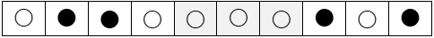
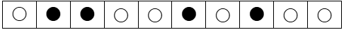

동전처럼 생긴 돌의 양면은 각각 흰색과 검은색으로 되어있고, 게임의 규칙은 다음과 같다.

뒤집기는 i번째부터 j개의 돌을 i번째 돌의 색으로 바꿔놓는다.
뒤집기는 가능한 돌에 대해서만 진행한다.
예시)
초기상태

i=5, j=3인 경우 뒤집기 결과

초기상태에서 i=9, j=3인 경우 뒤집기 결과, 11번째는 없으므로 두개만 뒤집기가 이뤄진다.

[입력]
첫 줄에 게임의 개수 T, 다음 줄부터 게임별로 첫 줄에 N, M, 다음 줄에 N개 돌의 초기상태, 이후 M개의 줄에 걸쳐 i, j가 주어진다.
(1<=T<=50, 3<=N<=20,   1<=M<=10, 1<=i, j<=N)

[출력]
#과 게임번호, 빈칸에 이어 빈칸으로 구분된 돌의 상태를 출력한다.