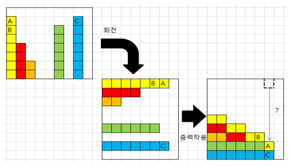

상자들이 쌓여있는 방이 있다. 방이 오른쪽으로 90도 회전하여 상자들이 중력의 영향을 받아 낙하한다고 할 때, 낙차가 가장 큰 상자를 구하여 그 낙차를 출력 하는 프로그램을 작성하시오.

•중력은 회전이 완료된 후 적용된다.
•상자들은 모두 한쪽 벽면에 붙여진 상태로 쌓여 2차원의 형태를 이루며 벽에서 떨어져서 쌓인 상자는 없다.
•상자의 가로, 세로 길이는 각각 1이다.
•방의 가로길이는 최대 100이며, 세로 길이도 최대 100이다.
•즉, 상자는 최소 0, 최대 100 높이로 쌓을 수 있다.
•상자가 놓인 가로 칸의 수 N, 다음 줄에 각 칸의 상자 높이가 주어진다.