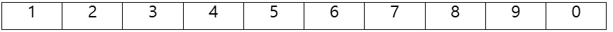
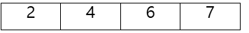
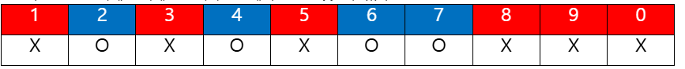
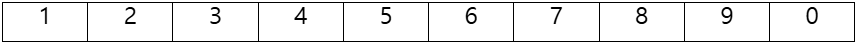
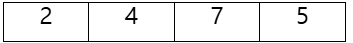
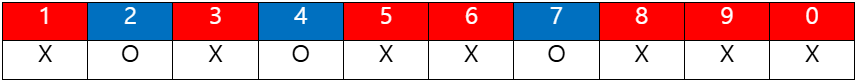

어떤 웹 사이트에서는 게시글을 작성하기 위해서 암호 코드를 입력해야 한다.
암호 코드는 특별한 방식으로 주어지는데, 구체적인 입력 방법은 아래와 같다.

먼저 보기에  N개의 1~10 사이의 숫자가 앞에서부터 차례대로 주어진다. 이 N개의 숫자는 중복이 가능하다.

그 다음에 아래에 1~10 사이의 M개(N > M)의 숫자가 주어진다.

이때, 보기에 있는 N개의 숫자들을 앞에서부터 순서대로 입력하거나, 입력하지 않고
M개의 숫자를 맞춰야 한다. 당신은 보기에 주어진 N개의 숫자로 M개의 숫자를 맞출수 있는지 판단하는 프로그램을 작성해야 한다.

예시1)
10개의 숫자가 아래 순서대로 주어진다.
1 2 3 4 5 6 7 8 9 0

4개의 숫자가 암호로 주어진다.
2 4 6 7

그렇다면 당신은 아래 순서대로 입력하면 M개의 암호를 맞출수 있다.

예시2)
10개의 숫자가 아래 순서대로 주어진다.
1 2 3 4 5 6 7 8 9 0

4개의 숫자가 암호로 주어진다.
2 4 7 5

그렇다면 당신은 먼저 입력된 숫자들을 어떻게 해도 7 다음의 5를 입력할 수가 없으니 암호를 맞출 수 없다.

[입력]
첫 번째 줄에 테스트 케이스의 개수 T가 주어진다. 각 테스트 케이스는 4개의 줄로 이루어진다.
첫 번째 줄에는 입력할수 있는 숫자의 개수 N이 주어진다. (1< N < 20)
두 번째 줄에는 N개의 숫자가 입력되는 순서대로 주어진다.
세 번째 줄에는 암호코드 숫자의 개수 M이 주어진다. ( M < N )
네 번째 줄에는 M개의 숫자가 주어진다.

[출력]
각 테스트 케이스 마다, 당신이 주어진 순서대로 숫자를 입력하거나 입력하지 않을때, 암호코드를 조합할 수 있는지 여부를 출력한다.
조합할수 있다면 1을, 조합할수 없다면 0을 출력한다. 

